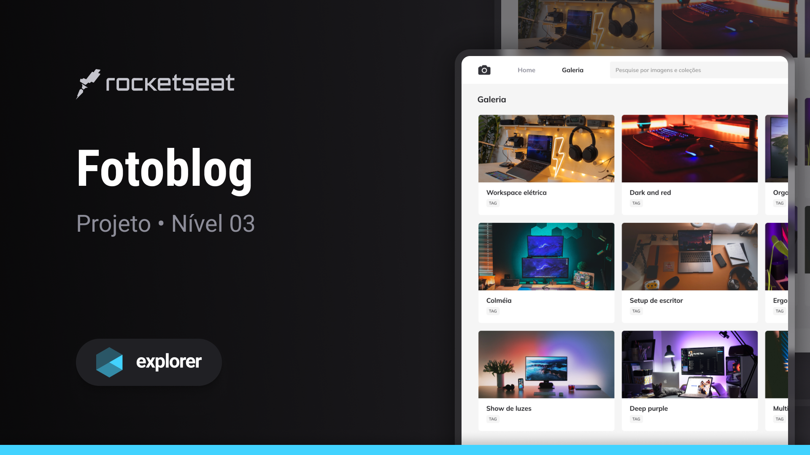

## 🖥️ Projeto

Esse é um projeto de treino avançado no CSS, utilizando efeitos e configurações avançadas.

## 🚀 Tecnologias

Esse projeto foi desenvolvido em aula na Rocketseat com as seguintes tecnologias:

- HTML
- CSS
- Git e Github